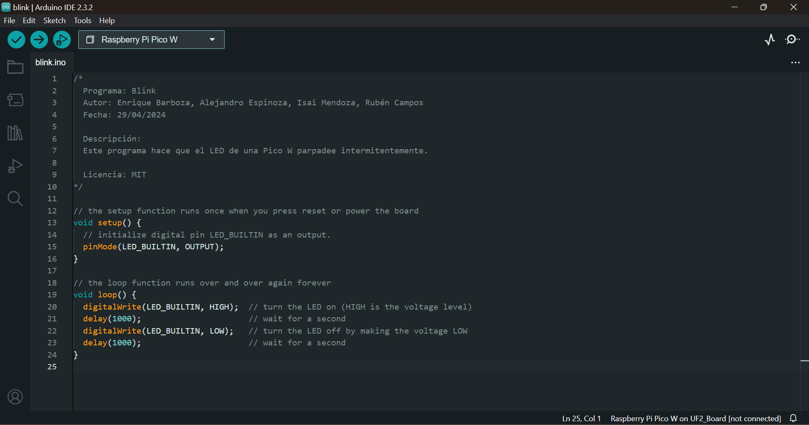
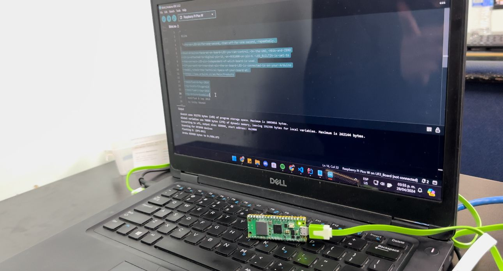
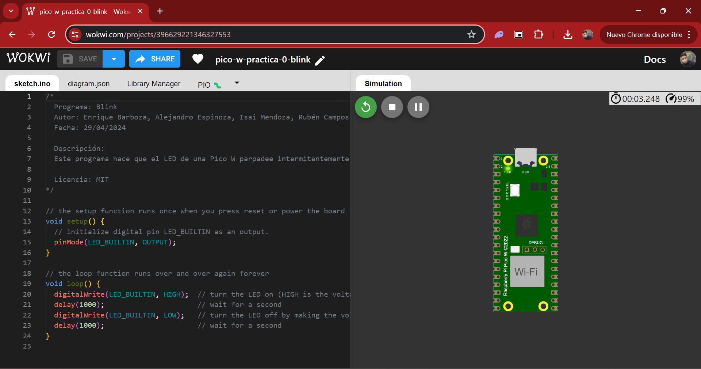

# Practica 0 - Blink

## Código

```c
/*
  Programa: Blink
  Autor: Enrique Barboza, Alejandro Espinoza, Isai Mendoza, Rubén Campos
  Fecha: 29/04/2024

  Descripción:
  Este programa hace que el LED de una Pico W parpadee intermitentemente.

  Licencia: MIT
*/

// the setup function runs once when you press reset or power the board
void setup() {
  // initialize digital pin LED_BUILTIN as an output.
  pinMode(LED_BUILTIN, OUTPUT);
}

// the loop function runs over and over again forever
void loop() {
  digitalWrite(LED_BUILTIN, HIGH);  // turn the LED on (HIGH is the voltage level)
  delay(1000);                      // wait for a second
  digitalWrite(LED_BUILTIN, LOW);   // turn the LED off by making the voltage LOW
  delay(1000);                      // wait for a second
}
```

## Captura del Código



## Captura Ejecución



## Captura del Simulador



## Link al Simulador

[Practica 0 - Blink](https://wokwi.com/projects/396629130789199873)

